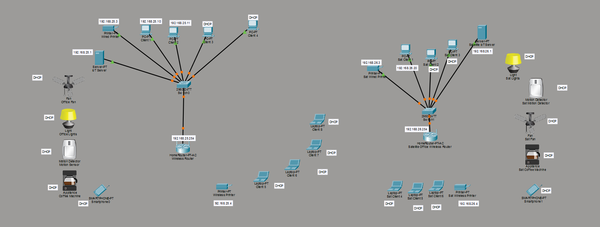
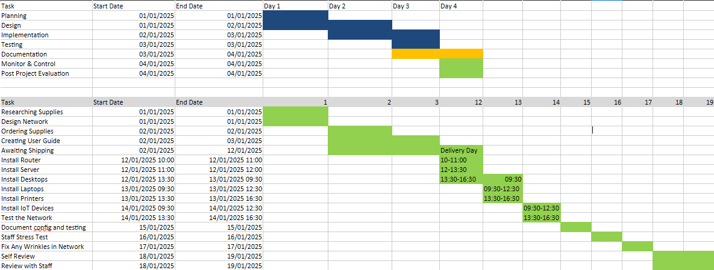
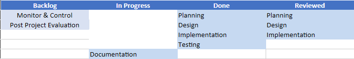

# it-support-portfolio
👋 Hi, I'm an entry-level IT Support candidate showcasing hands-on networking and documentation projects.

Level 3 IT Smart Tech Project

This repository showcases practical IT support, networking, and documentation work completed as part of hands-on training and self-directed projects.

## Skills Demonstrated
- Network configuration (static & DHCP)
- LAN segmentation & subnetting
- IoT device integration
- End-user documentation
- Troubleshooting methodology
- Project planning (Gantt & Kanban)
- Cisco Packet Tracer

## Projects Included

### 🖧 Smart Office Network (Cisco Packet Tracer)
Designed and configured a small office network with:
- Multiple subnets
- Wired & wireless devices
- DHCP and static IP allocation
- IoT server and connected smart devices
https://github.com/robsonchance-ops/it-support-portfolio/blob/306917d9eaeab83616e818a04b8144285443ce2f/SmartOffice%20project.pkt

### 📘 Network User Guide
Created a non-technical user guide enabling staff to:
- Connect devices via wired & Wi-Fi
- Configure static and dynamic IPs
- Add and manage IoT devices
- Perform basic troubleshooting
https://github.com/robsonchance-ops/it-support-portfolio/blob/Office-Sim-From-CCNA-Qualification/Smart%20Office%20User%20Guide.pdf

### 📊 Project Management
Planned and tracked the project using:
- Gantt chart (project timeline)
https://github.com/robsonchance-ops/it-support-portfolio/blob/Office-Sim-From-CCNA-Qualification/Gantt_Chart_Project.xlsx

- Kanban board (task flow & progress)
https://github.com/robsonchance-ops/it-support-portfolio/blob/Office-Sim-From-CCNA-Qualification/Kanban_Board_Project.xlsx

## Tools Used
- Cisco Packet Tracer
- Microsoft Excel
- Microsoft Word
- GitHub
## Career Goal
Seeking entry-level IT Support / Service Desk / Junior Network roles.
