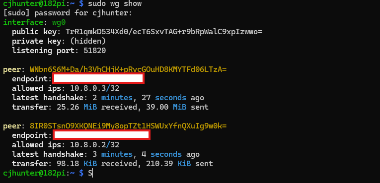
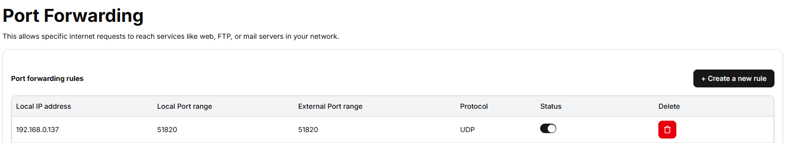
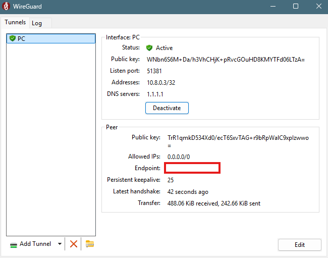
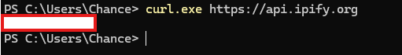

# Raspberry Pi WireGuard VPN

## Overview

I built and configured a self-hosted WireGuard VPN on a Raspberry Pi.

The goal of the project was to create a secure VPN server that allows remote devices to route their internet traffic through my home network.

This project gave me practical experience with Linux networking, VPN configuration, IP forwarding, NAT, port forwarding, SSH/SFTP, and troubleshooting.

## Hardware & Software

- Raspberry Pi
- Raspberry Pi OS (Debian Trixie)
- WireGuard
- Linux `iptables`
- systemd
- SSH/SFTP
- iPhone WireGuard client
- Windows WireGuard client
- Virgin Media Hub 5x router

## Network Design

```text
Internet
    │
    ▼
Virgin Media Router
    │
    │ UDP 51820
    ▼
Raspberry Pi
192.168.0.137
    │
    │ WireGuard
    │ 10.8.0.0/24
    │
    ├── Server: 10.8.0.1
    │
    ├── iPhone: 10.8.0.2
    │
    └── Windows PC: 10.8.0.3
```

## Configuration

### WireGuard Server

The Raspberry Pi runs the WireGuard interface `wg0`.

The server uses:

- Address: `10.8.0.1/24`
- Listen port: `51820`
- Protocol: UDP

IP forwarding was enabled using:

```text
net.ipv4.ip_forward=1
```

The setting was stored in:

```text
/etc/sysctl.d/99-wireguard.conf
```

I verified IP forwarding with:

```bash
sysctl net.ipv4.ip_forward
```

which returned:

```text
net.ipv4.ip_forward = 1
```

I also configured NAT using `iptables` so VPN clients can access the internet through the Raspberry Pi's Ethernet connection.

### Router Configuration

I configured port forwarding on the Virgin Media Hub 5x:

| Setting | Value |
|---|---|
| Local IP | 192.168.0.137 |
| Local port | 51820 |
| External port | 51820 |
| Protocol | UDP |
| Status | Enabled |

This allows incoming WireGuard traffic from the internet to reach the Raspberry Pi.

## Client Configuration

I created separate WireGuard peers for each device.

### iPhone

The iPhone was configured with:

```text
10.8.0.2/32
```

The connection was tested using both Wi-Fi and cellular data.

The WireGuard handshake successfully appeared on the Raspberry Pi, confirming that the phone was communicating with the VPN server.

### Windows PC

A separate peer was created for the Windows PC:

```text
10.8.0.3/32
```

The configuration was transferred from the Raspberry Pi using SFTP and imported into the Windows WireGuard application.

## Troubleshooting

During setup I encountered several issues which required troubleshooting.

### `/etc/sysctl.conf` Configuration

The original guide referenced `/etc/sysctl.conf`, but my Raspberry Pi OS installation used the `/etc/sysctl.d/` configuration directory.

I created:

```text
/etc/sysctl.d/99-wireguard.conf
```

with:

```text
net.ipv4.ip_forward=1
```

I then verified that IP forwarding was enabled with:

```bash
sysctl net.ipv4.ip_forward
```

### `iptables: command not found`

Initially WireGuard failed to start because `iptables` was not installed.

The error was:

```text
iptables: command not found
```

I identified the missing dependency, installed `iptables`, and then successfully started the WireGuard interface.

### Verifying the WireGuard Interface

I used:

```bash
ip link show wg0
```

to verify that the WireGuard network interface existed.

I also used:

```bash
sudo wg show
```

to inspect the server configuration and connected peers.

Once the iPhone connected, the server displayed a successful handshake and data transfer:

```text
latest handshake: ...
transfer: ... received, ... sent
```

This confirmed that the VPN connection was functioning.

## Skills Demonstrated

- Linux system administration
- Raspberry Pi administration
- Networking fundamentals
- IPv4 addressing
- NAT
- IP forwarding
- UDP port forwarding
- VPN configuration
- WireGuard
- `iptables`
- systemd services
- SSH
- SFTP
- Windows networking
- Troubleshooting
- Technical documentation

## What I Learned

This project helped me understand how a VPN works beyond simply installing a VPN application.

I configured the server, router, and individual clients myself, diagnosed configuration and package issues, and verified connectivity using Linux networking tools and WireGuard's own status information.

The project also reinforced the importance of understanding why a configuration is required rather than blindly following a tutorial.

## Project Outcome

The Raspberry Pi successfully operates as a WireGuard VPN server, with separate client configurations for my iPhone and Windows PC.

## Screenshots

### WireGuard server and peer handshake



### IP forwarding


### Router port forwarding



### Windows WireGuard client



### VPN connectivity test



Both clients can establish a WireGuard connection to the Raspberry Pi, with the server showing successful handshakes and traffic transfer.
